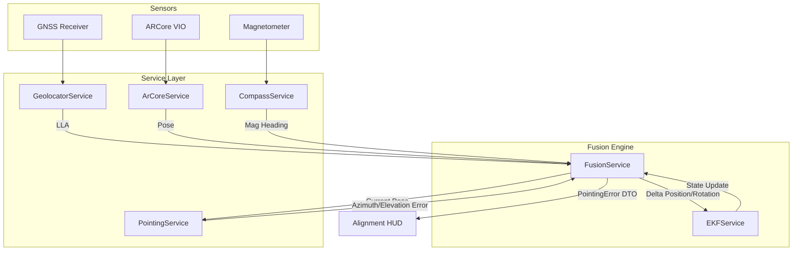
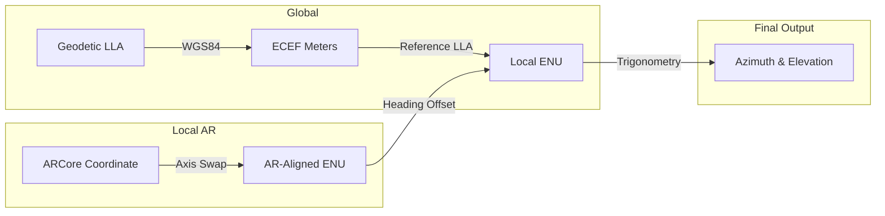
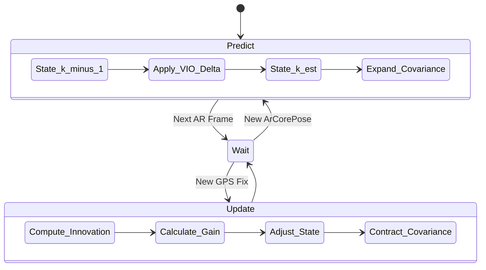
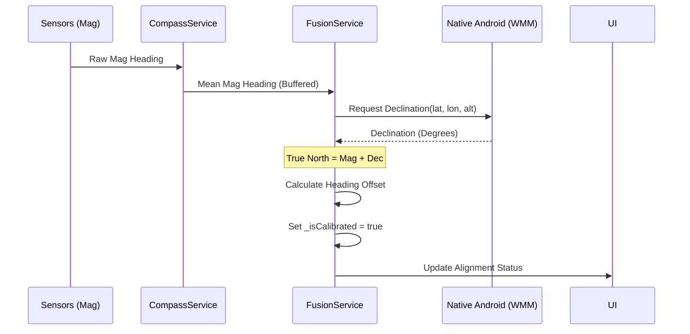
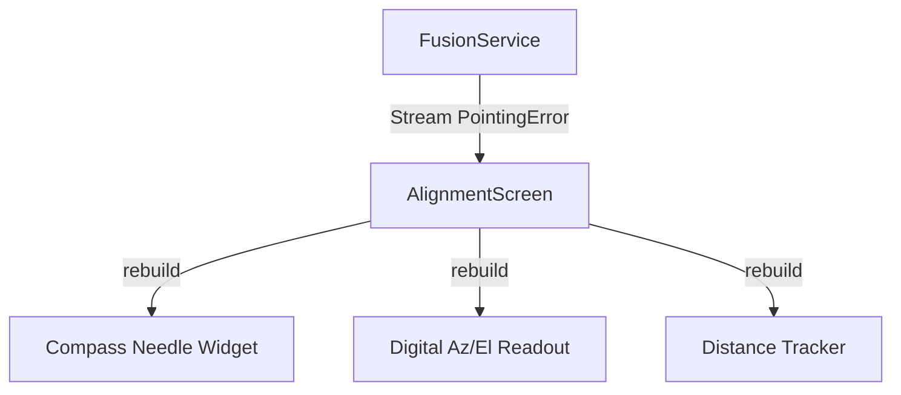

# Design Diagrams: Antenna Aligner

This document provides visual representations of the system architecture, data flow, and mathematical transformations using Mermaid.js syntax.

## 1. High-Level System Architecture
This diagram illustrates how raw sensor data flows through the service layer and EKF to produce the final guidance HUD.

## 2. Coordinate Transformation Flow
The "Rosetta Stone" of the project: mapping absolute Earth coordinates and local AR coordinates into a unified local metric ENU frame.

## 3. EKF Lifecycle (Predict & Update)
The recursive loop that maintains a stable pose even when individual sensors fail or lag.

## 4. Calibration Sequence
The process of aligning the virtual "North" with the geographic "True North."

## 5. UI Data Consumption
How the Flutter UI layer reacts to the stream of pointing errors.

